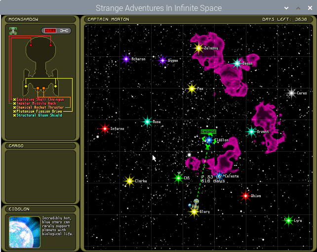

# Strange Adventures in Infinte Space (GPL) 1.6.2



(herein "SAIS GPL" since "Strange Adventures in Infinite Space" is a mouthful)

This port is the basis for the binaries now released by Digital Eel at the new SAIS webpage, 
https://rich.itch.io/strangeadventures - any release hosted here on Github (and not on itch),
however, is not official and should be treated as such.

The legacy website and last legacy release are available at http://digital-eel.com/sais/.

More about the Infinite Space games can be found at their official website, 
http://www.infinitespacegames.com/.

If you like SAIS GPL, please consider supporting Digital Eel by buying one 
(or more!) of their newer games (or donating at the itch.io page) as this release would
not have been possible without their generosity.

If you don't like SAIS GPL, it's possibly my fault and you should leave 
Digital Eel alone - they have no real responsibility for any (new) problems it may have.

Likewise, there are no warranties, explicit or implied for this software
(per the License).  

## New in 1.6.2

* Fixed a build issue for the "official" releases that produced a macOS binary that
  depended on 10.15.  The new build has been tested on macOS 10.11 successfully, and
  should work on everything inbetween too.
  
* If we have to abort because something went wrong with SDL, we now display a helpful
  messagebox with the error message we got from SDL (if we can!).  This is significantly
  more useful than what was happening before.
  
* Fixed the input mapping for text input to now handle case correctly.

## New in 1.6.1

* HighDPI display support for Retina display macs (and hopefully all other platforms).

* Now correctly uses linear filtering when rescaling the window if available - this
  produces a much smoother easy on the eyes appearance than the nearest rescale
  used previously.  This looks a LOT better to me on highDPI and high resolution
  displays.
  
  * Pixel Perfect will turn the filtering off to give you that crisp pixel perfect
    look if that's what you want.

## New in 1.6.0

SAIS GPL has few internal behavioural changes (mostly around mod handling), but
should play exactly the same as the 1.5 release.

Key changes to the game source include:

* Update from SDL1.x to SDL2

* Switch from OS Native file handling to PHYSFS.

  * Support loading gamedata and mods from zipfiles.

  * Make use of writable local directories for scores and config
  
* Support rescaling to native resolution full-screen including pixel perfect 
  scaling.
  
* Allow the main window to be resized on the fly.  Doesn't redraw whilst you're
  resizing (yet), but it will once the resize is complete.
  
* Inclusion of the Retail Data (see below for information about the license)

## Building on Windows

If you're using MSVC, I strongly recommend using [Conan](https://conan.io/) to
install the dependencies.  (see the notes on using Conan below).

SAIS GPL has been tested as an x64 binary on Windows 10, built using the
Visual Studio 2019 C++ compilers, using Conan to source and build the
dependencies.

## Building on Linux

I suggest NOT using Conan and relying on your distributions shipped SDL2+physfs.

There been issues with the conan built SDL2 on Linux not being able to reliably
load audio drivers when it and it's dependencies are linked statically.
  
This has been tested with SDL 2.0.10 and PhysFS 3.0.1 on Raspbian (armhf) and
has worked without issue.

The precompilied binaries here on github are built using Ubuntu 18.04 LTS and
its shipping libraries.  If they do not work for you, please build SAIS GPL from
the source.

### The 5 Second Guide to building from source on Linux

This is not an exhaustive guide to how to deal with everything that can go wrong
during the build, but should be enough for the simple case.

1. Make sure you have make, a recent cmake (3.15 or newer), your C++ 
   compilers, zip, and the development packages for SDL2, SDL2_mixer and 
   physfs installed.  All of these are required to build from source.
   
2. Fetch the source tree.
   ```shell script
   git clone https://github.com/kuroneko/sais
   ```

3. Make yourself a build directory and switch to it
   ```shell script
   mkdir sais-build && cd sais-build
   ```
   
4. Prepare the Project files
   ```shell script
   cmake -DCMAKE_INSTALL_PREFIX=${HOME}/games/sais ../sais
   ```
   
   You can substitute the path above to set where you want to install SAIS GPL.
   
5. Compile the project
   ```shell script
   make all
   ```
  
   This should produce a lot of output from the compiler and from zip as it
   builds the game executable and assembles the data zipfile.
    
6. Install the project into it's final home.        

   **NOTE:** You cannot run SAIS from the build-tree - you must install it.

   ```shell script
   # you will need to use sudo for the install if you're not installing into a
   # user-writable directory 
   make install
   ```

## Building on macOS

Use Conan to perform the build - whilst you can use brew provided sdl2 and 
physfs, you will have difficulties with rpaths and codesigning.

## Using Conan

You will need the [bincrafters](https://bincrafters.github.io/) repository
enabled to get the SDL2 and PhysFS packages in use.

You can do this by using the command:

    conan remote add bincrafters https://api.bintray.com/conan/bincrafters/public-conan 

Which will add the remote to your conan configuration.

You need to set the `USE_CONAN` option to `ON` (`-DUSE_CONAN=ON` via the command
line) to make the CMake project consider the Conan package data during build,
otherwise it will search your system paths for the libraries required. 

When using Conan with Windows, make sure that your profile uses the `MT` runtime
library, and not `MD`.

# Licensing

## The Game Source

<a rel="license" href="https://www.gnu.org/licenses/gpl-3.0.html"></a>

The Game Source code is provided under the GNU Public License version 3.

Please see [`COPYING.md`](COPYING.md) for the full text of the license.

    Strange Adventures in Infinite Space
    Copyright (C) 2005 Richard Carlson, Iikka Keranen and William Sears

    This program is free software: you can redistribute it and/or modify
    it under the terms of the GNU General Public License as published by
    the Free Software Foundation, either version 3 of the License, or
    (at your option) any later version.

    This program is distributed in the hope that it will be useful,
    but WITHOUT ANY WARRANTY; without even the implied warranty of
    MERCHANTABILITY or FITNESS FOR A PARTICULAR PURPOSE.  See the
    GNU General Public License for more details.

    You should have received a copy of the GNU General Public License
    along with this program.  If not, see <https://www.gnu.org/licenses/>.

## The Game Data

<a rel="license" href="http://creativecommons.org/licenses/by-nc/4.0/"></a>

Digital Eel have graciously provided permission to redistribute the original 
retail game data along-side the source code, with the game data licensed under a
<a rel="license" href="http://creativecommons.org/licenses/by-nc/4.0/">Creative Commons Attribution-NonCommercial 4.0 International License</a>.

The game data is everything in the `full`, `full-data`, `demo` and `demo-data` 
directories of this repository.

In summary:

You are free to:

* Share — copy and redistribute the material in any medium or format

* Adapt — remix, transform, and build upon the material

As long as you:

* give appropriate credit, provide a link to the license, and indicate if
  changes were made. You may do so in any reasonable manner, but not in any way
  that suggests the licensor (Digital Eel) endorses you or your use.
  
* do not use the material for commercial purposes.

(Thanks to the Creative Commons website for the explanatory text)

As suggested by the original README (below), There is nothing preventing you 
from producing a completely original dataset for SAIS GPL and doing with that 
as you will.

# Original Readme File

The original README makes references to licensing of content under the GPLv2,
which has been replaced with the GPLv3 as permitted by the license, and to the
game data, which has since been released under CC-BY-NC 4.0.  Please bear this 
in mind when reading it.

```
-----------------------------------------
Strange Adventures in Infinite Space v1.5
          source code release
           11 November 2005
-----------------------------------------

To celebrate the release of Weird Worlds: Return to Infinite
Space (see http://www.shrapnelgames.com ) we have decided to
release the source code to the game that started it all:
Strange Adventures in Infinite Space.

This release includes source code that can be used to build
executables for either the DEMO or the RETAIL version of 
Strange Adventures in Infinite Space. The game content of 
the DEMO version is included for your convenience, along with
Win32 binaries. This is an unsupported release; proceed at 
your own risk.

The main intentions behind the release are to allow user-made
modifications that include both code and new game content; 
and make it possible to port the executables to different 
platforms for users who own a retail copy of the game but want
to run it on Linux etc. 

To facilitate the latter, the code has been converted to use 
SDL and SDL_Mixer libraries rather than DirectX. You will need
to download these libraries for your programming platform at:
http://www.libsdl.org

Strange Adventures in Infinite Space source code is released
under the GNU General Public License version 2 or later. See
the attached gpl.txt or read more at the GNU website:
http://www.gnu.org/copyleft/gpl.html

To sum it up, you can do anything you want with the code
including selling derivatives of it, as long as you release 
the modified source code along with your application.

Please note that the license only applies to the source code 
and executable programs provided in this release. In order 
to make the release more useful, the content files required 
to run the DEMO version of Strange Adventures in Infinite 
Space are included. These files are identical to the demo 
available at SAIS website. You are free to distribute the 
DEMO contents as long as no modifications are made. 

Unauthorized distribution of the content (such as graphics, 
sounds etc) of the RETAIL version of Strange Adventures in 
Infinite Space is prohibited by copyright law. However, you
may use this source code to create and distribute executable
programs which utilize said content if legally obtained by 
the end-user.

Should you create a completely original set of game content,
you could obviously do anything you want with it.

SDL and SDL_Mixer are licensed under the LGPL license:
http://www.gnu.org/licenses/lgpl.html

-------------------------
Notes from the programmer
-------------------------

* The code is hideous. Sorry. This was my second Win32 app.

* There may be some vestiges of DirectX/Win32 code left over,
  such as #include statements. They should be safe to remove
  as the code now uses SDL for all input, video and sound.

* Project file for MSVC6 is included.

* sdl_main.cpp includes the main() function which sets the
  fullscreen/windowed flag. By default it runs in a window
  for easier debugging.

* If you make and distribute modified versions of the SAIS
  demo (as in new executable, using the demo content) I'd 
  appreciate if you labeled it as an "unofficial" version.

* Mods intended for those who own a retail copy should not
  include any of the game's original artwork or other 
  content in the distribution package, just the new code
  and your own content.

* Visit the SAIS website to read about the game:
  http://www.digital-eel.com/sais/

* Infinite Space federation is a third-party site with a
  SAIS modding forum which may be useful to you:
  http://www.freewebs.com/strangefederation/

Iikka Keranen

----------
Copyrights
----------

Copyright (C) 2005 Richard Carlson, Iikka Keranen and William Sears

This program is free software; you can redistribute it and/or
modify it under the terms of the GNU General Public License
as published by the Free Software Foundation; either version 2
of the License, or (at your option) any later version.

This program is distributed in the hope that it will be useful,
but WITHOUT ANY WARRANTY; without even the implied warranty of
MERCHANTABILITY or FITNESS FOR A PARTICULAR PURPOSE.  See the
GNU General Public License for more details.

You should have received a copy of the GNU General Public License
along with this program; if not, write to the Free Software
Foundation, Inc., 51 Franklin Street, Fifth Floor, Boston, MA  02110-1301, USA.
```
